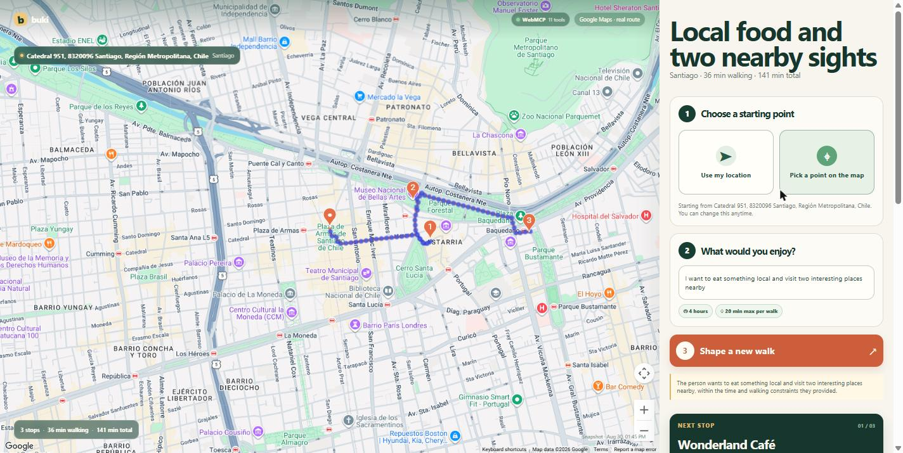
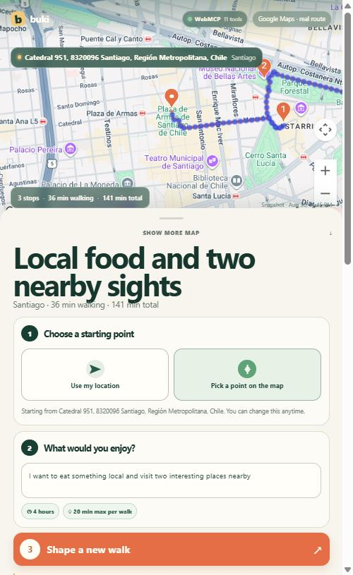
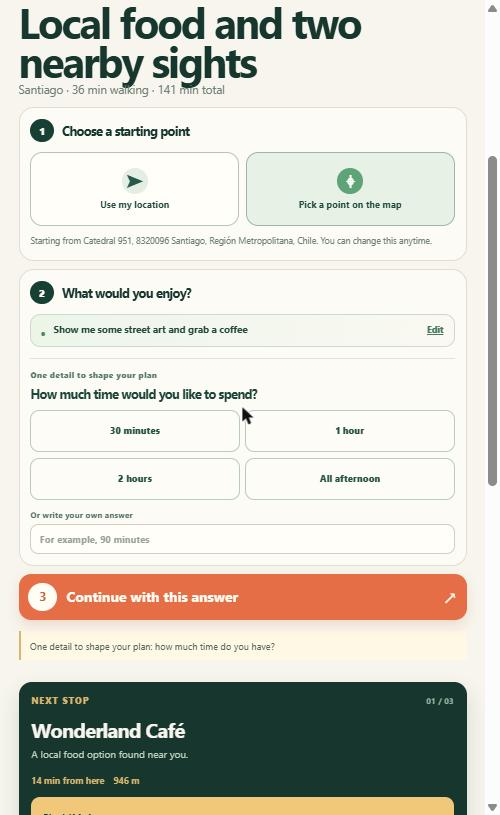
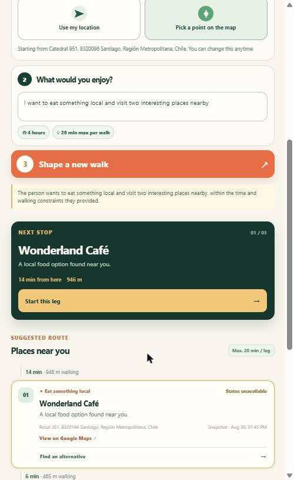
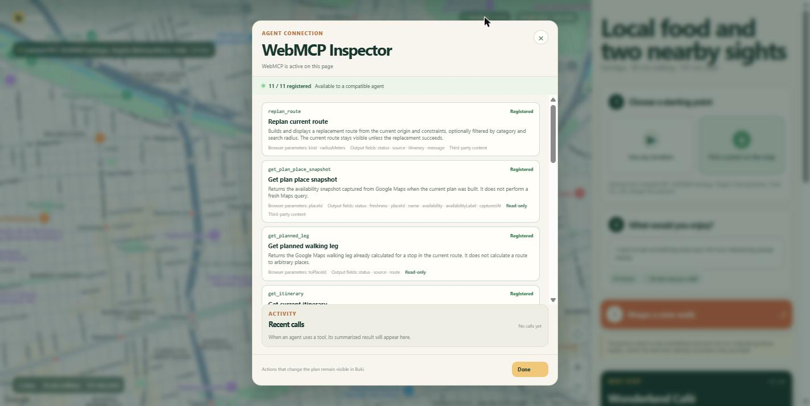

# Buki

**Turn “what should I do today?” into a real, walkable itinerary.**

[Try the live WebMCP experience](https://buki-iota.vercel.app/)

Buki starts with a real location and a natural-language idea—not a fictional route. It asks only for the details that make a plan practical, then uses Google Maps to find real nearby places and calculate a walking route.



*A real plan built from Plaza de Armas, Santiago: three stops, 36 minutes of walking, every leg within the 20-minute limit the person chose.*

## The experience

1. Choose your current location or drop a pin anywhere in the world.
2. Describe what you would enjoy in your own words.
3. Buki asks for time and walking comfort when they are missing.
4. Create a plan built from real places and real walking routes.

There are no hidden walking or time defaults. If a stop no longer works, Buki can propose a real nearby replacement that preserves the route constraints; the person decides whether to apply it or undo it.

The map behaves like an app, with direct pan and zoom, native zoom controls, and bounded global navigation that prevents empty or duplicated world views.

The whole story works on a phone-sized screen:

| The route on the map | Buki asks instead of guessing | The plan, stop by stop |
| --- | --- | --- |
|  |  |  |
| The map stays inside Buki, so the person never switches apps to follow the plan. | A new request never invents a duration or a walking limit—and the plan already on screen is left untouched until a replacement succeeds. | Each stop carries its real address, the walking leg that reaches it, and the time its availability was captured. |

## WebMCP: the same journey for an agent

Buki exposes eleven WebMCP tools so a compatible browser agent can work through the same visible experience:

1. Call `set_origin` after the person approves a location.
2. Call `plan_walk` with their intent. If duration or walking comfort is missing, it returns `needs_clarification` instead of querying Maps.
3. Call `plan_walk` again with `availableMinutes` and `maxWalkMinutes` once the person answers.
4. Read and guide the visible itinerary with `get_itinerary`, `get_plan_place_snapshot`, `get_planned_leg`, `focus_stop`, and `advance_to_next_stop`.
5. Call `propose_stop_repair` if a person says a stop is unavailable. Buki shows the real alternative and requires the person to confirm or keep the current route.

`replan_route` only works after Buki has the person’s planning preferences, keeps the current route intact until a replacement succeeds, and tries alternative place combinations before rejecting the approved limits. Availability returned by `get_plan_place_snapshot` is explicitly the timestamped snapshot captured while building the current plan, not a fresh lookup. The **WebMCP · 11 tools** button opens an in-app inspector with input schemas, output schemas, and recent calls.



*The inspector reads the schemas back from the browser, so what it displays is what the agent actually sees.*

Tools are registered with the imperative API:

```ts
await document.modelContext.registerTool({
  name: 'get_planned_leg',
  title: 'Get planned walking leg',
  description: 'Returns the Google Maps walking leg already calculated for a stop in the current route. It does not calculate a route to arbitrary places.',
  inputSchema: {
    type: 'object',
    properties: { toPlaceId: { type: 'string', description: 'Leg destination.' } },
    required: ['toPlaceId'],
    additionalProperties: false,
  },
  outputSchema: {
    type: 'object',
    properties: {
      status: { type: 'string', enum: ['ok'] },
      source: { type: 'string', enum: ['google-maps-plan'] },
      route: { type: 'object' },
    },
  },
  annotations: { readOnlyHint: true },
  execute: (input) => getPlannedLeg(input),
})
```

The name says what the tool does: it reads a leg Buki already calculated, rather than implying a fresh Routes call.

## Why WebMCP matters here

A normal map interface can show places, but it does not give an agent a reliable contract for the person's current origin, constraints, itinerary, active stop, and repair state. WebMCP lets the agent read and act on that same live state without scraping the screen. The person remains in the visible Buki experience, while the agent can ask for missing constraints, build the route, guide the next stop, and propose a real replacement when the plan changes.

Buki's differentiators are deliberate: it refuses to invent missing time or walking limits, uses Google Maps rather than LLM-generated places, and treats stop repair as a visible proposal that requires human confirmation.

## Architecture

```text
Person or WebMCP agent
          |
          v
React application -----> Google Maps JavaScript API
          |               places, status, walking routes
          v
Vercel /api/plan -----> configured LLM provider
          |
          v
structured constraints only; geographic truth stays with Maps
```

## Run locally

```powershell
npm install
Copy-Item .env.example .env
npm run dev
```

`npm run dev` serves both the Vite interface and a local adapter for `/api/plan`; no Vercel CLI or login is required. The adapter invokes the same server-side handler that Vercel will run after deployment, so local planning does not call a deployed Vercel Function.

Minimum configuration:

```text
VITE_GOOGLE_MAPS_API_KEY=

# Server-side only. Never give these variables a VITE_ prefix.
LLM_API_KEY=
LLM_API_URL=https://openrouter.ai/api/v1
LLM_MODEL=minimax/minimax-m3:free
LLM_FALLBACK_MODEL=cohere/north-mini-code:free
```

`VITE_GOOGLE_MAPS_API_KEY` is intentionally available to the browser because the Google Maps JavaScript API loads there. Treat it as a public identifier, not a secret: in Google Cloud restrict it to Buki's allowed HTTP referrers, only the Maps APIs Buki needs, and a bounded quota. `LLM_API_KEY` must remain server-side and must never use a `VITE_` prefix.

`VITE_BUKI_API_URL` and `VITE_GOOGLE_MAPS_MAP_ID` are optional. Leaving the API URL empty uses same-origin `/api/plan` locally and after deployment. `BUKI_MODE`, `BUKI_ALLOWED_ORIGINS`, `BUKI_RATE_LIMIT_MAX`, and `BUKI_RATE_LIMIT_WINDOW_MS` are server-side operational overrides with defaults; set `BUKI_ALLOWED_ORIGINS=https://buki-iota.vercel.app` only in Vercel Production. The in-process limit is a first barrier for a small public prototype; production deployments must also configure distributed rate limiting, provider spend caps, Google Maps HTTP-referrer restrictions, API restrictions, and daily quotas.

## Test and build

```powershell
npm test
npm run typecheck
npm run build
```

The suite covers deterministic candidate selection, route-limit decisions, active-stop progress, WebMCP contracts, LLM fallback, and a simulated LLM/Maps flow for both route creation and stop repair. A local browser check also exercises the real Maps and configured LLM path.

## Deploy to Vercel

Import the repository with root directory `.`. Vercel detects the Vite app and deploys `api/*.ts` as functions. Configure the environment variables above, keep all LLM variables server-side, and leave `VITE_BUKI_API_URL` empty when the API is served from the same deployment.

Before publishing, verify the full flow in the deployed app and configure rate limits and spending controls in the hosting, LLM, and Google Cloud consoles. After this version is deployed, Buki's [Privacy Policy](https://buki-iota.vercel.app/privacy.html) and [Terms of Use](https://buki-iota.vercel.app/terms.html) are served with the application.

## Project documents

- [Product contract](./BUKI_PRODUCT_CONTRACT.md)
- [Build plan](./BUKI_BUILD_PLAN.md)
- [WebMCP challenge rules](./RULES.md)
- [Prior-work boundary](./PRIOR_WORK.md)
